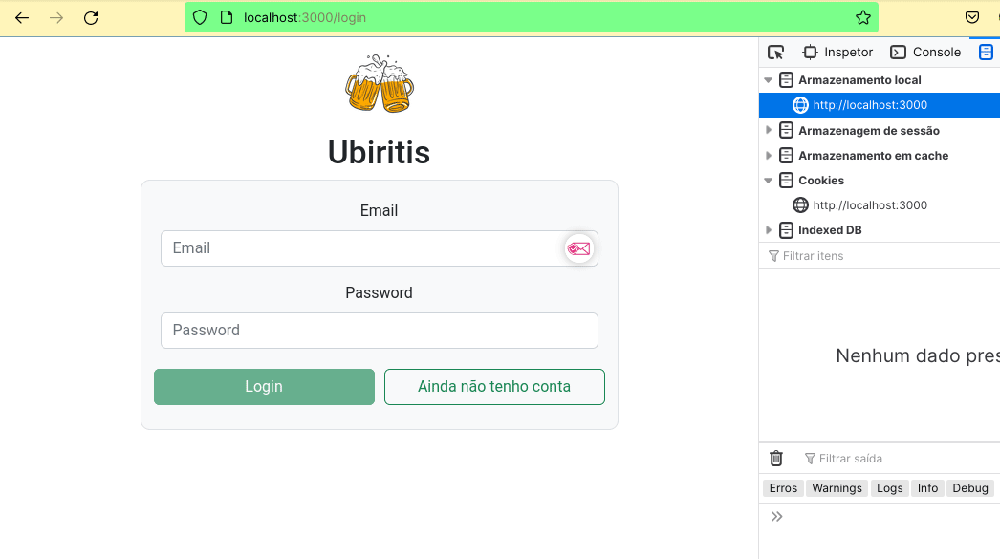

# Ubirits
App made on october, 2022. With error in route fixed to push to this repository.

#### Developed during two weeks in a bootcamp, me and four participants were responsible for create and integrate back-end and front-end application to a beer delivery store. We learned how to work as a team and used Kanban to organize our tasks. Our context story was to create an app to a local store that was growing and needed an online page to receive and control orders and orders status. We created a login page for customers, employees and manager to access and create users in database, a products and sales page to select products and change delivery status, this status change and orders appeared for customers and employees also. With an Entity Relationship Diagram (ERD) we created a database with MySQL using Node.js, Express and Sequelize ORM with Model View Controller (MVC) architecture. Our REST API was able to make a complete CRUD in the roles, sales and products in the database. (The name is a pun with “uber eats” and a local word to describe beer “birita”, it’s an app for a delivery beer store).
Unfortunately this project was developed in a private repository and I wasn't able to retreive my commit history.

## We used JavaScript, React, Reactstrap for styling and Sequelize for managing the database using MVC architecture.

  

#### To be able to see my project running:

- download the repo;
- inside folder **front-end** type `npm install` and press enter in your terminal;
- inside folder **back-end** type `npm install` and press enter in your terminal;
- you are going to need a SQL instance in your computer, I use MySQL inside a Docker container, but you can download and use MySQL as a standalone app, be sure to configure your .env file with your info, there is a .env.example file for you, just add your local user and password.
- type `npm start` in the **back-end** folder and press enter;
- type `npm start` in the **front-end** folder and press enter, the application will open in your browser;

